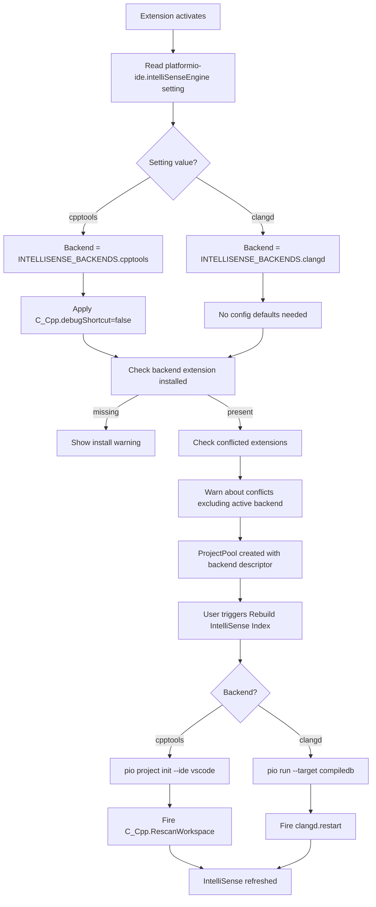

# intelClangd IntelliSense Backend for PlatformIO IDE

## Inventory of every touchpoint that must change

| File                                      | What it does today                                                                                             | What must change                                                                                                               |
| ----------------------------------------- | -------------------------------------------------------------------------------------------------------------- | ------------------------------------------------------------------------------------------------------------------------------ |
| `src/constants.js`                        | Exports `CONFLICTED_EXTENSION_IDS` (hardcoded list)                                                            | Add backend descriptors; derive conflict list from selected backend                                                            |
| `src/misc.js`                             | `warnAboutConflictedExtensions()` uses `CONFLICTED_EXTENSION_IDS`; `warnAboutInoFile()` shows generic message  | Use dynamic conflict list from active backend; keep .INO warning as-is                                                         |
| `src/main.js`                             | Calls `misc.warnAboutConflictedExtensions()` at startup                                                        | Also call new backend detection/notification logic after activation                                                            |
| `src/project/manager.js`                  | Creates `ProjectPool` with `ide: 'vscode'`; registers `rebuildProjectIndex` command                            | Pass resolved IDE identifier to pool; after rebuild, call backend rescan command                                               |
| `platformio-node-helpers/.../indexer.js`  | Runs `pio project init --ide <ide>`                                                                            | Accept and use a new `ide` value (e.g. `'vscode'` vs a compiledb-based flow); optionally run `pio run -t compiledb` for clangd |
| `platformio-node-helpers/.../tasks.js`    | `fetchEnvTasks()` creates "Rebuild IntelliSense Index" task with `['project', 'init', '--ide', this.ide, ...]` | Use the correct rebuild args based on IDE/backend                                                                              |
| `platformio-node-helpers/.../observer.js` | Passes `this.options` (including `ide`) to `ProjectIndexer`                                                    | No change needed (passes through)                                                                                              |
| `platformio-node-helpers/.../pool.js`     | Passes `this.options` to `ProjectObserver`                                                                     | No change needed (passes through)                                                                                              |
| `package.json`                            | `extensionDependencies: ["ms-vscode.cpptools"]`; `configurationDefaults: { "C_Cpp.debugShortcut": false }`     | Remove hard dep; add new setting; conditionally apply defaults                                                                 |

---

## Step 1: Add IntelliSense backend descriptors to `src/constants.js`

Replace the current `CONFLICTED_EXTENSION_IDS` export with a backend registry and a helper that derives the conflict list.

**File:** [src/constants.js](src/constants.js)

**Replace entire file contents with:**

```javascript
/**
 * Copyright (c) 2017-present PlatformIO <contact@platformio.org>
 * All rights reserved.
 *
 * This source code is licensed under the license found in the LICENSE file in
 * the root directory of this source tree.
 */

export const IS_WINDOWS = process.platform.startsWith("win");
export const IS_OSX = process.platform == "darwin";
export const IS_LINUX = !IS_WINDOWS && !IS_OSX;
export const PIO_CORE_VERSION_SPEC = ">=6.1.6";
export const STATUS_BAR_PRIORITY_START = 10;

export const INTELLISENSE_BACKENDS = {
  cpptools: {
    id: "cpptools",
    label: "Microsoft C/C++ (cpptools)",
    extensionId: "ms-vscode.cpptools",
    rescanCommand: "C_Cpp.RescanWorkspace",
    configDefaults: { "C_Cpp.debugShortcut": false },
    indexerIde: "vscode",
    rebuildArgs: (env) => {
      const args = ["project", "init", "--ide", "vscode"];
      if (env) {
        args.push("--environment", env);
      }
      return args;
    },
  },
  clangd: {
    id: "clangd",
    label: "clangd (vscode-clangd)",
    extensionId: "llvm-vs-code-extensions.vscode-clangd",
    rescanCommand: "clangd.restart",
    configDefaults: {},
    indexerIde: "vscode",
    rebuildArgs: (env) => {
      const args = ["run", "--target", "compiledb"];
      if (env) {
        args.push("--environment", env);
      }
      return args;
    },
  },
};

export const ALWAYS_CONFLICTED_EXTENSION_IDS = ["vsciot-vscode.vscode-arduino"];

export function getConflictedExtensionIds(backendId) {
  const allBackendExtIds = Object.values(INTELLISENSE_BACKENDS).map(
    (b) => b.extensionId,
  );
  const activeExtId = INTELLISENSE_BACKENDS[backendId]
    ? INTELLISENSE_BACKENDS[backendId].extensionId
    : undefined;
  return [
    ...ALWAYS_CONFLICTED_EXTENSION_IDS,
    ...allBackendExtIds.filter((id) => id !== activeExtId),
  ];
}
```

**Key design decisions:**

- `cpptools` backend: keeps using `pio project init --ide vscode` (generates `.vscode/c_cpp_properties.json`).
- `clangd` backend: uses `pio run --target compiledb` (generates `compile_commands.json` in project root, which is exactly what [clangd expects](https://clangd.llvm.org/installation#project-setup)).
- `rescanCommand`: after rebuild completes, we fire the backend's rescan command so it picks up new index data.
- Conflict list: the non-active C++ backend extension + always-conflicted extensions.

---

## Step 2: Add the `platformio-ide.intelliSenseEngine` setting to `package.json`

**File:** [package.json](package.json)

### 2a. Add new setting inside `contributes.configuration.properties` (after `autoRebuildAutocompleteIndex`)

After line 724 (`"description": "Automatically rebuild the project IntelliSense index..."`), after the closing `}` of that property, insert:

```json
"platformio-ide.intelliSenseEngine": {
  "type": "string",
  "enum": [
    "cpptools",
    "clangd"
  ],
  "enumDescriptions": [
    "Use Microsoft C/C++ extension (ms-vscode.cpptools) - generates c_cpp_properties.json",
    "Use clangd extension (vscode-clangd) - generates compile_commands.json"
  ],
  "default": "cpptools",
  "markdownDescription": "Select which C/C++ IntelliSense engine PlatformIO should use. `cpptools` generates `.vscode/c_cpp_properties.json` via `pio project init`. `clangd` generates `compile_commands.json` via `pio run -t compiledb`. Changing this setting requires a window reload."
},
```

### 2b. Remove hard `extensionDependencies`

Change the bottom of `package.json` (lines 907-909) from:

```json
"extensionDependencies": [
  "ms-vscode.cpptools"
]
```

to:

```json
"extensionDependencies": []
```

This removes the hard requirement so the extension can activate without cpptools installed.

### 2c. Update `configurationDefaults`

Change line 699-701 from:

```json
"configurationDefaults": {
  "C_Cpp.debugShortcut": false
},
```

to:

```json
"configurationDefaults": {},
```

Config defaults will now be applied programmatically based on the selected backend (see Step 5).

---

## Step 3: Create new `src/intellisense.js` module

This is the single entry point for all backend-aware logic. Other files will import from here instead of directly using constants.

**File:** `src/intellisense.js` (new file)

```javascript
/**
 * Copyright (c) 2017-present PlatformIO <contact@platformio.org>
 * All rights reserved.
 *
 * This source code is licensed under the license found in the LICENSE file in
 * the root directory of this source tree.
 */

import { INTELLISENSE_BACKENDS, getConflictedExtensionIds } from "./constants";
import { extension } from "./main";
import vscode from "vscode";

export function getActiveBackendId() {
  return extension.getConfiguration("intelliSenseEngine") || "cpptools";
}

export function getActiveBackend() {
  const id = getActiveBackendId();
  return INTELLISENSE_BACKENDS[id] || INTELLISENSE_BACKENDS.cpptools;
}

export function getActiveConflictedExtensionIds() {
  return getConflictedExtensionIds(getActiveBackendId());
}

export function isBackendExtensionInstalled() {
  const backend = getActiveBackend();
  return !!vscode.extensions.getExtension(backend.extensionId);
}

export async function applyBackendConfigDefaults() {
  const backend = getActiveBackend();
  const config = vscode.workspace.getConfiguration();
  for (const [key, value] of Object.entries(backend.configDefaults)) {
    const inspected = config.inspect(key);
    if (
      inspected &&
      inspected.globalValue === undefined &&
      inspected.workspaceValue === undefined
    ) {
      await config.update(key, value, vscode.ConfigurationTarget.Global);
    }
  }
}

export async function notifyRescanBackend() {
  const backend = getActiveBackend();
  if (!backend.rescanCommand) {
    return;
  }
  try {
    await vscode.commands.executeCommand(backend.rescanCommand);
  } catch (err) {
    console.warn(
      `Failed to execute rescan command "${backend.rescanCommand}": ${err.message}`,
    );
  }
}

export function warnIfBackendMissing() {
  if (isBackendExtensionInstalled()) {
    return;
  }
  const backend = getActiveBackend();
  vscode.window
    .showWarningMessage(
      `PlatformIO: The selected IntelliSense engine "${backend.label}" ` +
        `requires the "${backend.extensionId}" extension, but it is not installed.`,
      { title: "Install Extension", isCloseAffordance: false },
      { title: "Dismiss", isCloseAffordance: true },
    )
    .then((selected) => {
      if (selected && selected.title === "Install Extension") {
        vscode.commands.executeCommand(
          "workbench.extensions.search",
          backend.extensionId,
        );
      }
    });
}
```

---

## Step 4: Update `src/misc.js` to use dynamic conflict list

**File:** [src/misc.js](src/misc.js)

### 4a. Change the import on line 9

From:

```javascript
import { CONFLICTED_EXTENSION_IDS } from "./constants";
```

To:

```javascript
import { getActiveConflictedExtensionIds } from "./intellisense";
```

### 4b. Change `warnAboutConflictedExtensions()` line 58-59

From:

```javascript
const conflicted = vscode.extensions.all.filter(
  (ext) => ext.isActive && CONFLICTED_EXTENSION_IDS.includes(ext.id),
);
```

To:

```javascript
const conflictedIds = getActiveConflictedExtensionIds();
const conflicted = vscode.extensions.all.filter(
  (ext) => ext.isActive && conflictedIds.includes(ext.id),
);
```

No other changes needed in this file.

---

## Step 5: Update `src/main.js` to wire backend logic at startup

**File:** [src/main.js](src/main.js)

### 5a. Add import at top (after line 12)

After the existing imports, add:

```javascript
import {
  applyBackendConfigDefaults,
  warnIfBackendMissing,
} from "./intellisense";
```

### 5b. Add backend initialization calls in `activate()` (after line 102)

After `misc.warnAboutConflictedExtensions();` (line 102), add two new calls:

```javascript
applyBackendConfigDefaults();
warnIfBackendMissing();
```

The `activate` method lines 101-107 will look like:

```javascript
misc.maybeRateExtension();
misc.warnAboutConflictedExtensions();
applyBackendConfigDefaults();
warnIfBackendMissing();
this.subscriptions.push(
  vscode.window.onDidChangeActiveTextEditor((editor) =>
    misc.warnAboutInoFile(editor),
  ),
);
```

---

## Step 6: Update `src/project/manager.js` to pass backend info and rescan after rebuild

**File:** [src/project/manager.js](src/project/manager.js)

### 6a. Add import (after line 11)

After the existing imports, add:

```javascript
import { getActiveBackend, notifyRescanBackend } from "../intellisense";
```

### 6b. Pass backend to the ProjectPool options

In the constructor, the `ProjectPool` options object (line 33-91) currently has `ide: 'vscode'`. Change line 34:

From:

```javascript
      ide: 'vscode',
```

To:

```javascript
      ide: getActiveBackend().indexerIde,
      intelliSenseBackend: getActiveBackend(),
```

### 6c. Wrap `rebuildProjectIndex` to rescan after rebuild

Change the `rebuildProjectIndex` command registration (lines 109-111):

From:

```javascript
      vscode.commands.registerCommand('platformio-ide.rebuildProjectIndex', () =>
        this._pool.getActiveObserver().rebuildIndex({ force: true }),
      ),
```

To:

```javascript
      vscode.commands.registerCommand('platformio-ide.rebuildProjectIndex', async () => {
        await this._pool.getActiveObserver().rebuildIndex({ force: true });
        await notifyRescanBackend();
      }),
```

---

## Step 7: Update `platformio-node-helpers/.../indexer.js` to use backend-specific rebuild args

**File:** [platformio-node-helpers/platformio-node-helpers/src/project/indexer.js](platformio-node-helpers/platformio-node-helpers/src/project/indexer.js)

### 7a. Change `_rebuildWithProgress` to use backend rebuild args

Lines 100-104 currently build the args:

```javascript
const args = ["project", "init", "--ide", this.options.ide];
if (this.observer.getSelectedEnv()) {
  args.push("--environment", this.observer.getSelectedEnv());
}
```

Replace with:

```javascript
const backend = this.options.intelliSenseBackend;
const args = backend
  ? backend.rebuildArgs(this.observer.getSelectedEnv())
  : ["project", "init", "--ide", this.options.ide];
if (!backend && this.observer.getSelectedEnv()) {
  args.push("--environment", this.observer.getSelectedEnv());
}
```

This uses the backend's `rebuildArgs()` function if a backend descriptor is passed in (which it will be from Step 6b). The fallback preserves the old behavior if no backend is provided.

For **cpptools**: runs `pio project init --ide vscode [--environment X]` (same as today).
For **clangd**: runs `pio run --target compiledb [--environment X]` (generates `compile_commands.json`).

---

## Step 8: Update `platformio-node-helpers/.../tasks.js` to use backend-specific rebuild task

**File:** [platformio-node-helpers/platformio-node-helpers/src/project/tasks.js](platformio-node-helpers/platformio-node-helpers/src/project/tasks.js)

### 8a. Accept backend in constructor

Change the constructor (line 150-153):

From:

```javascript
  constructor(projectDir, ide) {
    this.projectDir = projectDir;
    this.ide = ide;
  }
```

To:

```javascript
  constructor(projectDir, ide, intelliSenseBackend) {
    this.projectDir = projectDir;
    this.ide = ide;
    this.intelliSenseBackend = intelliSenseBackend;
  }
```

### 8b. Change the "Rebuild IntelliSense Index" task in `fetchEnvTasks()`

Lines 187-193 currently build the task:

```javascript
const initTask = new TaskItem(
  "Rebuild IntelliSense Index",
  ["project", "init", "--ide", this.ide, "--environment", name],
  "Miscellaneous",
);
initTask.multienv = true;
result.push(initTask);
```

Replace with:

```javascript
const rebuildArgs = this.intelliSenseBackend
  ? this.intelliSenseBackend.rebuildArgs(name)
  : ["project", "init", "--ide", this.ide, "--environment", name];
const initTask = new TaskItem(
  "Rebuild IntelliSense Index",
  rebuildArgs,
  "Miscellaneous",
);
initTask.multienv = true;
result.push(initTask);
```

---

## Step 9: Pass backend through the observer/pool chain

### 9a. `platformio-node-helpers/.../observer.js`

**File:** [platformio-node-helpers/platformio-node-helpers/src/project/observer.js](platformio-node-helpers/platformio-node-helpers/src/project/observer.js)

Line 30 creates `ProjectTasks` with two args:

```javascript
this._projectTasks = new ProjectTasks(this.projectDir, this.options.ide);
```

Change to:

```javascript
this._projectTasks = new ProjectTasks(
  this.projectDir,
  this.options.ide,
  this.options.intelliSenseBackend,
);
```

No other changes needed in `observer.js` or `pool.js` -- the `options` object already flows through unchanged.

---

## Step 10: Remove clangd from the old hardcoded conflict list

Since `src/constants.js` was rewritten in Step 1, the old `CONFLICTED_EXTENSION_IDS` export no longer exists. However, verify there are no other imports of it.

**Check:** The only import was in [src/misc.js](src/misc.js) line 9, which was updated in Step 4a. No other file imports `CONFLICTED_EXTENSION_IDS`.

---

## Summary of all files changed

| File                                      | Action                                                                                                 |
| ----------------------------------------- | ------------------------------------------------------------------------------------------------------ |
| `src/constants.js`                        | Rewrite: add `INTELLISENSE_BACKENDS`, `ALWAYS_CONFLICTED_EXTENSION_IDS`, `getConflictedExtensionIds()` |
| `src/intellisense.js`                     | **New file**: backend resolution, config defaults, rescan, missing-extension warning                   |
| `src/misc.js`                             | Change import and `warnAboutConflictedExtensions()` to use dynamic conflict list                       |
| `src/main.js`                             | Add import + two calls (`applyBackendConfigDefaults`, `warnIfBackendMissing`)                          |
| `src/project/manager.js`                  | Add import; pass `intelliSenseBackend` to pool; wrap rebuild command with rescan                       |
| `platformio-node-helpers/.../indexer.js`  | Use `backend.rebuildArgs()` instead of hardcoded `pio project init` args                               |
| `platformio-node-helpers/.../tasks.js`    | Accept backend in constructor; use `backend.rebuildArgs()` for task                                    |
| `platformio-node-helpers/.../observer.js` | Pass `intelliSenseBackend` to `ProjectTasks` constructor                                               |
| `package.json`                            | Add `intelliSenseEngine` setting; empty `extensionDependencies`; empty `configurationDefaults`         |

## How it works end-to-end



## What users will experience

- **Default behavior is unchanged.** The setting defaults to `"cpptools"`, so existing users see zero difference.
- **To switch to clangd:** User installs `vscode-clangd`, sets `"platformio-ide.intelliSenseEngine": "clangd"`, reloads. PlatformIO will generate `compile_commands.json` instead of `c_cpp_properties.json`, and restart clangd after each rebuild.
- **Conflict detection** dynamically adjusts: when using clangd, cpptools is flagged as conflicting (and vice versa).
- **Missing backend warning** fires if the user selects a backend whose extension isn't installed.

Reference to clangd:[https://clangd.llvm.org/installation#project-setup](https://clangd.llvm.org/installation#project-setup)
